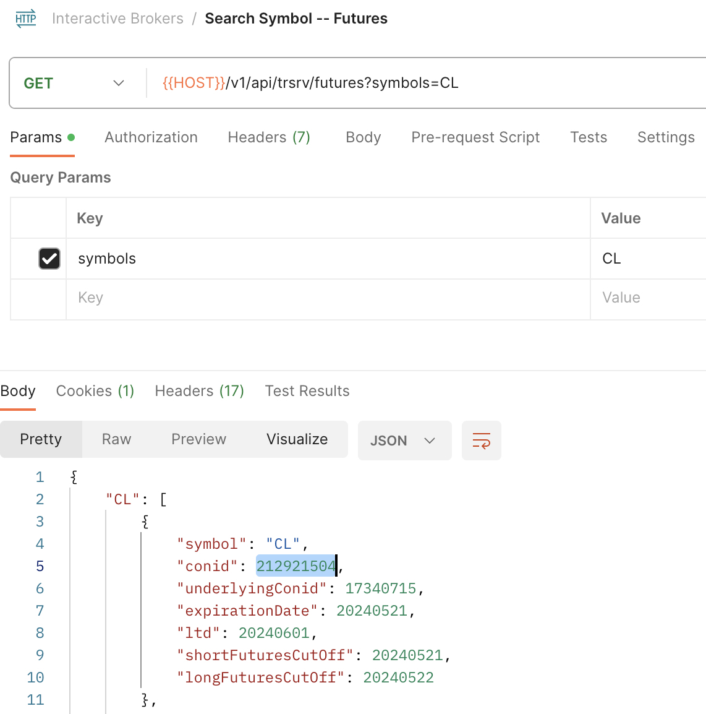

# slack-trading
A mock trading platform.

# Development
We use python's bump2version for managing the app version.

## Container Registry
Docker containers are hosted on vultr. Before pushing and pulling, you need to login.
``` bash
docker login https://ewr.vultrcr.com/grodt -u $VULTR_REGISTRY_USER -p $VULTR_REGISTRY_PASS
```
`VULTR_REGISTRY_USER` and `VULTR_REGISTRY_PASS` can be found on the Vultr console.

## Installing bump2version
``` bash
python3 -m ensurepip --upgrade
python3 -m pip install --user bump2version
```

### Managing
1. Each Dockerfile has a `# Version: 1.x.x` at the top.
2. Each Dockerfile also has a `.bumpversion.cfg` file, since we want to manage each version number separately.


# Deployment
Our production environment is hosted on vultr and managed with fluxcd. Manifests are stored in `.clusters/production`

## Spin up a New Cluster
To start a new cluster, navigate to the Vultr dashboard, click "Kubernetes" and "+ Add Cluster."

### Install the SealedSecrets controller
``` bash
brew install helm
helm repo add bitnami https://charts.bitnami.com/bitnami
kubectl create namespace sealed-secrets
helm install sealed-secrets bitnami/sealed-secrets --namespace sealed-secrets
```

### Add a Deploy Key to the Cluster (this can be skipped if the sealedsecret has already been created)
Flux needs a deploy key in order to pull from GitHub. Create one and then apply it to the cluster as a sealed secret.

First, create a namespace for the app
``` bash
kubectl create namespace grodt
```

Second, create a normal secret from the private key file
``` bash
kubectl create secret generic flux-git-deploy \
  --namespace grodt \
  --from-file=identity=<absolute-path-to-your-private-key> \
  --dry-run=client -o yaml > secret.yaml
```

Third, convert the secret into a sealed secret:
``` bash
kubeseal  --controller-name=sealed-secrets --controller-namespace=sealed-secrets --format yaml < secret.yaml > ${PROJECTS_DIR}/slack-trading/.clusters/production/sealedsecret-flux-git-deploy.yaml
```

Fourth, apply the sealed secret to the cluster
``` bash
kubectl apply -f ${PROJECTS_DIR}/slack-trading/.clusters/production/sealedsecret-flux-git-deploy.yaml
```

## Connect to an Existing Cluster
### Configure Local Machine to Remote Cluster
Log into the Vultr dashboard and download the cluster's config file.
``` bash
export KUBECONFIG=export KUBECONFIG="/Users/jamal/projects/grodt/vultr-k8s.yaml"
```

### Secrets
We use `kubeseal` for managing encrypted secrets
``` bash
brew install kubeseal
```

Assuming you have `.env.production` in the `src/` directory, convert an env file to a kubernetes secret:
``` bash
cd path/to/cmd
./convert_env_to_secret.sh
```

Convert the secret to a sealed secret and deploy with the sealed secret with:
``` bash
kubeseal --controller-name=sealed-secrets --controller-namespace=sealed-secrets --format yaml < cmd/secret.yaml > .clusters/production/sealedsecret.yaml
```

### Config
Similarly, create a configmap from an env file with command:
``` bash
cd path/to/cmd
./convert_env_to_config.sh
```

Remove any variables that you do not wish to use.

### Connecting
Go to the vultr dashboard and download the kube context file.
``` bash
export KUBECONFIG=/Users/jamal/projects/grodt/vultr-k8s.yaml
```

# Telemetry
Currently using the free tier of telemetry cloud: https://grafana.com/orgs/jac475. Used the following guide to set up: https://grafana.com/docs/grafana-cloud/monitor-applications/application-observability/setup/quickstart/go/

## See Telemetry Data
1. Launch Grafana
2. Click "Data Sources" in the side menu
3. Click grafanacloud-jac475-traces -> "Explore"
4. Select: Query type -> "Search"

# Running locally
## Install golang and python
Both golang:1.20 and python:3.7.9 are required.

If installing on ubuntu:
``` bash
sudo apt-get install python3.8-venv
```

## Initiate your python env
``` bash
cd path/to/slack-trading/src/cmd/stats
python3 -m venv $PROJECTS_DIR/slack-trading/src/cmd/stats/env
$PROJECTS_DIR/slack-trading/src/cmd/stats/env/bin/pip install -r src/cmd/stats/requirements.txt
```

# Dockerfile
## Prod
We currently host the base 1 and base 2 images at vultr. In order to access them, log in with:
``` bash
docker login https://ewr.vultrcr.com/base1 -u $VULTR_USER -p $VULTR_PASS
```

`$VULTR_USER` and `VULTR_PASS` can both be foound in the vultr dashboard, under Container Registry.

## Dev
As such the main program can be built with commands:
``` bash
docker build -f Dockerfile.base -t grodt-base-image .
docker build -f Dockerfile.base2 -t grodt-base-image-2 .
docker build -f Dockerfile.dev -t grodt-main .
```

## Prod
We are currently using heroku for prod. In order to upload new base images:
``` bash
heroku container:login
docker tag <image> registry.heroku.com/<app>/<process-type>
docker push registry.heroku.com/<app>/<process-type>
heroku container:release web -a <app>
```

For example, *app* is `grodt` and *process-type* is `web`

# Installation
1. Make sure docker is running
2. Install eventstoredb
``` bash
docker pull eventstore/eventstore:release-5.0.11
```

## Database
See README.md in infra project. Currently running on local Ubuntu box.

# Start Up
3. Make sure eventstoredb is running
``` bash
cd eventstoredb
docker-compose up
```
4. Run the interactive brokers daemon
``` bash
cd path/to/grodt/interactive-brokers/clientportal
./bin/run.sh root/conf.yaml
```
Open https://localhost:5000 to login


# Interactive brokers
Common instructions for working with interactive brokers
## Add a New Symbol to the Data Feed
1. Find the conid using postman




## Google Sheets Authentication
Navigate to console.cloud.google.com (jamal@yumyums.kitchen)

Click the navigation menu (hamburger menu - top left) -> APIs & Services -> Enabled APIs & services. Click the 'Credentials' tab.

To authenticate, create a service account on Google Cloud. Under **Keys**, select "Add Key" -> "Create new key". Download and base64 the JSON credentials file, and set the environment variable `KEY_JSON_BASE64` to base64 string.

# Hosting
The app is hosted on heroku

## Logs
Logs can be found via command:
``` bash
cd path/to/slack-trading
heroku logs
```

# Slack
UI is administered via slack. Admin page can be found here: https://api.slack.com/apps/A03C4E2TA6M

Events are sent to https://api.slack.com/apps/A03C4E2TA6M/event-subscriptions?

# Heroku
If deploying to heroku, there are some gochas:

1. If the application does not have a web port, heroku will terminate the application. This can be prevented by running:
``` bash
heroku ps:scale worker=1
```